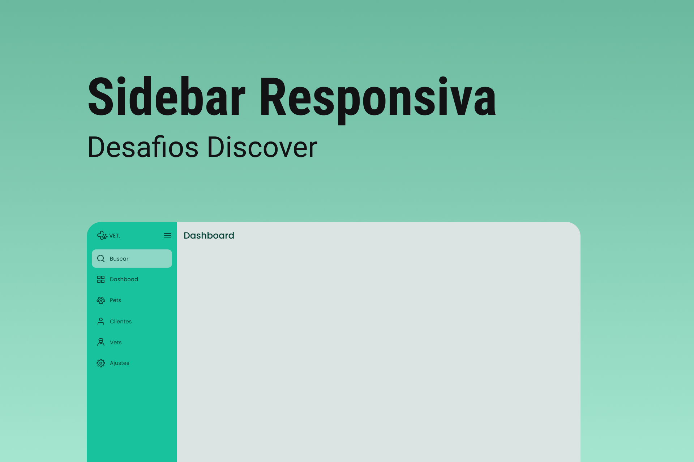

<h1 align="center">
  Sidebar
</h1>

  
  
  

<h1 align="center">
  
</h1>

## 💻 Projeto

O projeto é uma sidebar que quando o usuário clica no ícone do menu isso deve fazer com que o estado da sidebar mude entre "aberto", mostrando ícones e texto e "fechado", mostrando apenas os ícones.

## 🧪 Tecnologias

Esse projeto foi desenvolvido com as seguintes tecnologias

- HTML
- CSS
- JavaScript

## 🚀 Como executar

O app estará disponível acessando esse endereço [https://pduartesilva2005.github.io/discover-desafio-sidebar/](https://pduartesilva2005.github.io/discover-desafio-sidebar/)

---

Feito com 💜 by Pedro Duarte 👋🏻
